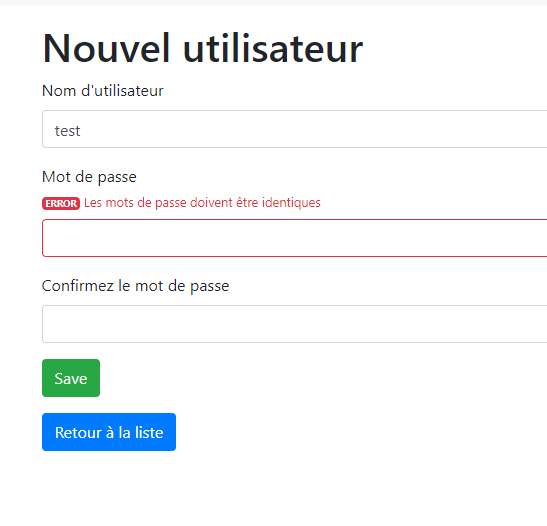
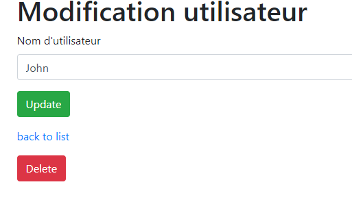
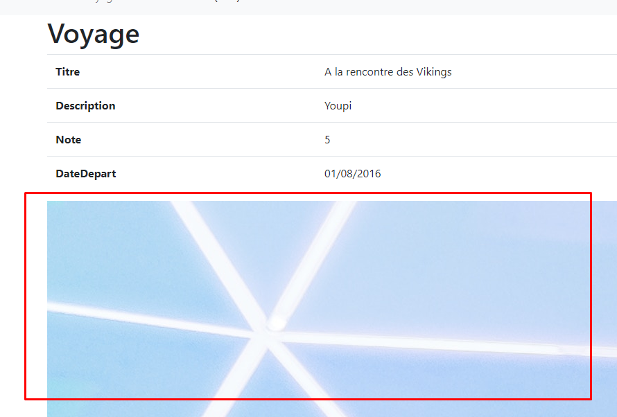

# Formulaires

Dans les différents CRUD générés par la commande `php bin/console make:crud`, nous allons retoucher les formulaires générés.

Cela implique de passer en revue les différents fichiers sous le dossier `src/Form`, afin que les types de champs soien corrects et qu'on puisse afficher ces formulaires dans nos templates.

Nous devrons aussi modifier quelques classes de contrôleurs, dans notre cas sous le dossier `src/Admin`, pour prendre en charge des uploads de fichier par exemple.

## Utilisateur

Pour le CRUD utilisateur, nous avons besoin de la fonctionalité suivante :

- A la création, renseigner un nom d'utilisateur (login), un mot de passe et une confirmation de mot de passe (2 champs pour le mot de passe donc, pour éviter les fautes de frappe)

- A l'édition, pouvoir éditer le nom d'utilisateur uniquement. On ne laissera pas la possibilité d'éditer un mot de passe depuis l'administration, on va plutôt partir du principe qu'on implémentera une fonctionnalité "Réinitialiser le mot de passe" plus tard

> **Note : On pourra aussi changer la fonctionnalité de création d'utilisateur, pour qu'un email soit envoyé à la création du compte, sans avoir précisé de mot de passe, pour que l'utilisateur puisse cliquer sur un lien et définir lui-même son mot de passe. Vu que nous n'envoyons pas d'email mais que nous voulons quand même créer des utilisateurs, pour le moment on laisse la définition du mot de passe à la création**

### Champ mot de passe

Pour gérer le cas où un utilisateur doit saisir 2 valeurs identiques afin de valider cette données, on va utiliser le type [RepeatedType](https://symfony.com/doc/current/reference/forms/types/repeated.html).

> Fichier : src/Form/UserType.php

```php
//...
public function buildForm(FormBuilderInterface $builder, array $options)
{
    //...
    $builder->add('password', RepeatedType::class, [
        'type' => PasswordType::class,
        'invalid_message' => 'Les mots de passe doivent être identiques',
        'options' => ['attr' => ['class' => 'password-field']],
        'required' => true,
        'first_options'  => ['label' => 'Mot de passe'],
        'second_options' => ['label' => 'Confirmez le mot de passe']
    ]);
    //...
    }
}
//...
```

Les différentes options sont consultables dans le lien de documentation. Cette configuration devrait donner un formulaire de ce type, avec gestion de l'erreur en cas de mots de passe différents dans les 2 champs :



Le code Twig est le suivant :

> Fichier : templates/admin/user/new.html.twig

```twig

    <div class="container pt-3">
        <h1>Nouvel utilisateur</h1>

        {{ include('admin/user/_form.html.twig') }}

        <a href="{{ path('admin_user_index') }}" class="btn btn-primary mr-3">Retour à la liste</a>
    </div>


```

> Fichier : templates/admin/user/_form.html.twig

```twig
{{ form_start(form) }}
    {{ form_errors(form) }}
    {{ form_widget(form) }}
    <button class="btn btn-success mb-3">{{ button_label|default('Save') }}</button>
{{ form_end(form) }}
```

### Chiffrement du mot de passe

Pour chiffrer le mot de passe renseigné, nous allons devoir retoucher notre contrôleur `UserController`.

Nous injectons le service autowiré `UserPasswordEncoderInterface` directement dans le contrôleur `new`.

> Les classes de contrôleurs supportent l'injection de dépendance par le constructeur ou directement dans le contrôleur
---
> Fichier : src/Controller/Admin/UserController.php

```php
/**
 * @Route("/new", name="user_new", methods={"GET","POST"})
 */
public function new(Request $request, UserPasswordEncoderInterface $encoder): Response
{
    $user = new User();
    $form = $this->createForm(UserType::class, $user);
    $form->handleRequest($request);

    if ($form->isSubmitted() && $form->isValid()) {
        $entityManager = $this->getDoctrine()->getManager();

        $password = $user->getPassword();
        $user->setPassword($encoder->encodePassword(
            $user,
            $password
        ));

        $entityManager->persist($user);
        $entityManager->flush();

        return $this->redirectToRoute('admin_user_index');
    }

    return $this->render('admin/user/new.html.twig', [
        'user' => $user,
        'form' => $form->createView(),
    ]);
}
```

> #### Note : on aurait aussi pu définir un [listener](https://symfony.com/doc/current/event_dispatcher.html) branché sur un événement de [cycle de vie de Doctrine](https://www.doctrine-project.org/projects/doctrine-orm/en/2.6/reference/events.html#lifecycle-events), `prePersist` par exemple, déclenché avant de persister une entité. Cela aurait permis d'automatiser le chiffrement du mot de passe lors d'une création d'utilisateur, quel que soit l'endroit d'où on crée l'utilisateur

### Edition de l'utilisateur

Dans notre formulaire d'édition, nous ne voulons pas que notre champ de mot de passe apparaisse.

Nous allons donc générer ce champ de manière conditionnelle, en fonction de l'entité gérée qui est transmise.

Si une entité n'a pas d'ID, c'est que MySQL ne lui en a pas attribué un avec l'AUTO_INCREMENT.

On peut donc considérer que c'est une nouvelle entité, non gérée par Doctrine, donc pas encore persistée.

Dans notre constructeur de formulaire, nous allons générer le champ de mot de passe à partir de là :

```php
public function buildForm(FormBuilderInterface $builder, array $options)
    {
        // Récupération de l'entité
        $user = $builder->getData();

        $builder
            ->add('login', TextType::class, [
                'label' => "Nom d'utilisateur"
            ]);

        // ID null ? Nouvelle entité, mot de passe à saisir
        if (is_null($user->getId())) {
            $builder->add('password', RepeatedType::class, [
                'type' => PasswordType::class,
                'invalid_message' => 'Les mots de passe doivent être identiques',
                'options' => ['attr' => ['class' => 'password-field']],
                'required' => true,
                'first_options'  => ['label' => 'Mot de passe'],
                'second_options' => ['label' => 'Confirmez le mot de passe']
            ]);
        }
    }
```

Du coup, en fonction du contexte, automatiquement, le formulaire affichera ou non le champ de mot de passe. Ici pour l'édition :



Il n'y a rien de plus à modifier dans le contrôleur, le formulaire transmis fera le contrôle sur le nom d'utilisateur saisi dans le formulaire

## Voyage

Dans notre voyage, nous allons vouloir uploader des fichiers. Des photos, en l'occurence.

Nous allons utiliser le type de champ [FileType](https://symfony.com/doc/current/reference/forms/types/file.html) pour pouvoir renseigner des fichiers dans notre formulaire.

Cependant, nous ne pouvons pas l'utiliser tel quel. Dans notre entité `Voyage`, les photos sont déclarées en tant que `ArrayCollection` dans le constructeur. Il ne s'agit donc pas d'un fichier isolé dans le voyage, mais d'un lien vers plusieurs autres entités contenant chacune un lien vers un fichier.

> Il faut donc adapter notre `FileType` pour :
>
> - Accepter plusieurs fichiers
> - Gérer notre upload dans notre contrôleur

Dans la construction de notre formulaire, nous allons utiliser les options suivantes : `required`, `mapped` et `multiple`.

> Fichier : src/Form/VoyageType.php

```php
public function buildForm(FormBuilderInterface $builder, array $options)
{
    $builder
        //...
        ->add('photos', FileType::class, [
            'label' => 'Photos du voyage',
            'mapped' => false,
            'multiple' => true,
            'required' => false
        ])
    ;
}
```

On ne l'a pas mis en "requis" pour éviter d'avoir à uploader des photos même quand on est en édition de voyage.

### Gestion de l'upload

Le champ d'upload n'étant plus mappé à notre entité, aucun contrôle de validation ne va se lancer pour tenter de le remplir.

Nous pouvons donc gérer nos uploads nous-mêmes, à l'aide d'une boucle :

```php
/**
 * @Route("/new", name="voyage_new", methods={"GET","POST"})
 */
public function new(Request $request): Response
{
    $voyage = new Voyage();
    $form = $this->createForm(VoyageType::class, $voyage);
    $form->handleRequest($request);

    if ($form->isSubmitted() && $form->isValid()) {
        $entityManager = $this->getDoctrine()->getManager();

        $photos = $form['photos']->getData();

        foreach ($photos as $itemPhoto) {
            $photo = new Photo();
            $photo->setVoyage($voyage);

            $destination = $this->getParameter('voyage_photo_folder');

            $fileName = uniqid() . '.' . $itemPhoto->guessExtension();
            $itemPhoto->move(
                $destination,
                $fileName
            );

            $photo->setFilePath($fileName);
            $entityManager->persist($photo);
        }

        $entityManager->persist($voyage);

        $entityManager->flush();

        return $this->redirectToRoute('admin_voyage_index');
    }

    return $this->render('admin/voyage/new.html.twig', [
        'voyage' => $voyage,
        'form' => $form->createView(),
    ]);
}
```

L'instruction `$photos = $form['photos']->getData();` nous permet de récupérer un tableau de type `UploadedFile`. C'est sur les éléments uploadés que nous allons boucler.

Vous pouvez retrouver le reste dans la documentation déjà transmise, section "Images".

### A propos des paramètres de configuration

Nous avons utilisé l'instruction `$destination = $this->getParameter('voyage_photo_folder');` dans le contrôleur.

Le paramètre d'application est défini dans le fichier `services.yaml` :

> Fichier : config/services.yaml

```yaml
#...
parameters:
  voyage_photo_public_path: '/uploads/voyage'
  voyage_photo_folder: '%kernel.project_dir%/public%voyage_photo_public_path%'
#...
```

> On peut faire référence à une variable de configuration depuis une autre variable de configuration avec `%la_variable%`

### Note : validation du format de fichier, dimensions, pistes d'améliorations

Nous aurions pu faire différemment. L'entité `Voyage` contient une collection d'entités `Photo`.

Le champ `photos` dans `VoyageType` aurait donc pu devenir un [CollectionType](https://symfony.com/doc/current/reference/forms/types/collection.html).

Par la suite, il aurait fallu créer un formulaire de `Photo`, `PhotoType` par exemple, avec un champ de formulaire de type `FileType`.

La validation du fichier aurait donc été déléguée par `VoyageType` à `PhotoType`.

Pur finir, nous aurions pu ajouter des [contraintes de validation](https://symfony.com/doc/current/reference/constraints/Image.html) dans l'entité `Photo`.

Ainsi, notre formulaire aurait davantage de possibilités de validation et de gestion des erreurs (sur le format de fichier, la taille, les dimensions de l'image, etc...voir la doc, tout est dedans).

> N'hésitez pas à vous lancer dans un changement de ce formulaire avec cette note. Créez une nouvelle branche dans votre dépôt Git pour éviter de perdre votre travail précédent

### Affichage des photos

> On peut déclarer une variable globale pour Twig, utilisable dans tous les templates. Editer le fichier `config/packages/twig.yaml` comme suit :

```yaml
twig:
    #...
    globals:
      voyage_photo_public_path: '%voyage_photo_public_path%'
```

Pour finir, nous pouvons donc afficher les photos dans une fiche voyage :

> Fichier : templates/admin/voyage/show.html.twig

```twig
{# ... #}
<div class="mb-4">
    
        
    
</div>
{# ... #}
```

Le souci, c'est que nos images ne sont pas du tout redimensionnées, ni optimisées pour l'affichage :



### Installation et utilisation de [LiipImagineBundle](https://symfony.com/doc/2.0/bundles/LiipImagineBundle/index.html)

A venir.
